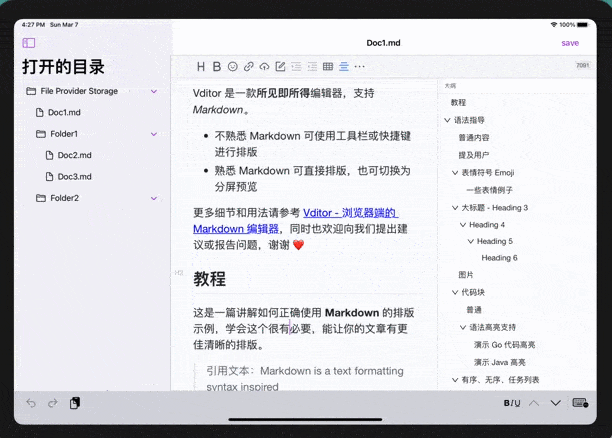
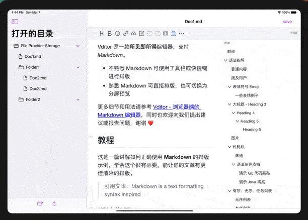

# marknote
An iOS Markdown Editor app based on [Vditor](https://github.com/Vanessa219/vditor), a next generation markdown editor.

## Installation

This app is now under early development, and is not available on App Store. If you want to try it now. you can clone this repository and build it through Xcode.

TODO: package and App Store

## Functions and Usage

1. Access any folders available in File App:

 

(Picture above is got on an simulator, iCloud works fine on real machine)

2. Open a .md file and edit it in WYSIWYG(wysiwyg), Instant Rendering(ir) and Split View(sv):

 

3. Manage your docs and folders in the sidebar:

4. Editor theme follows system appearences:

Note: due to simulator performance, the conversion of editor theme above is a little bit laggy (no such problem on real machine)

## development

My own develop Environment: macOS Big Sur 11.2.1, Xcode 12.4

This project is developed through swiftUI and WKWebView, so as long as your dev Environment supports both of those, then everything should be fine. If you do encounter some problem while building, just raise a issue.